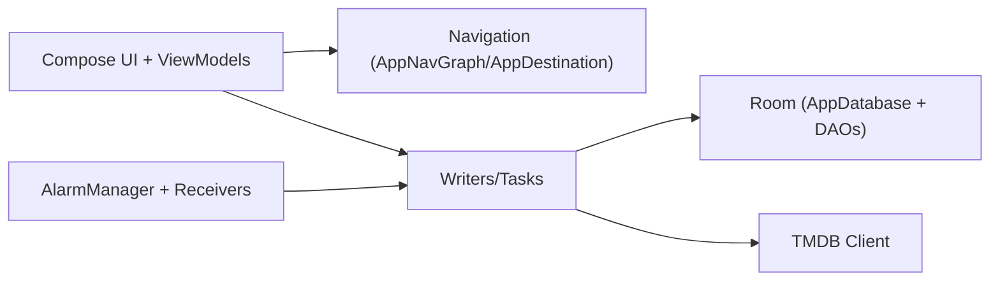
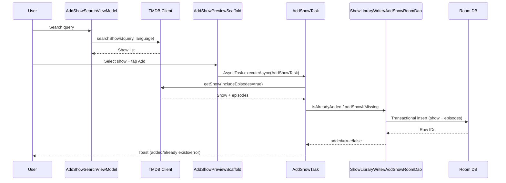
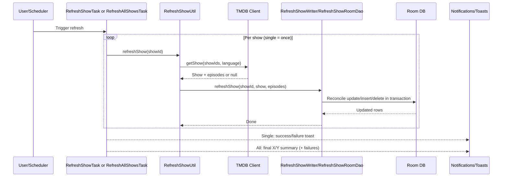

# Keep Track Architecture

## Purpose and Audience
This document is for contributors changing data flow, background work, or state boundaries in Keep Track. It explains how UI state is produced, how metadata refresh and backup/restore are executed, and where to extend the app safely.

## Tech Stack Snapshot
- UI: Jetpack Compose + Material 3
- Navigation: Navigation Compose (`AppNavGraph`, `AppDestination`)
- Dependency Injection: Hilt (`AppModule`)
- Persistence: Room over legacy SQLite tables (`AppDatabase`, DAOs, writers)
- Metadata source: TMDB via `tvdb/Client`
- Background execution: Coroutine-based `AsyncTask` wrapper + task callables
- Platform scheduling: `AlarmManager`, `BroadcastReceiver`, legacy `IntentService`

## System Context
Keep Track is a single-process Android app that stores a local show/episode library and syncs metadata from TMDB.

Core responsibilities:
- Render list/detail/season/episode screens from Room-derived read models.
- Mutate watch state, starring, archiving, and show membership.
- Fetch/refresh remote metadata and reconcile it with local rows.
- Produce manual and scheduled backups and support restore.

## Module/Package Map
- `ui/`: screen composables and ViewModels; transforms DAO rows into UI state.
- `navigation/`: typed route contracts and custom nav arg encoding/decoding.
- `db/room/`: entities, DAO query/update contracts, and writer abstractions for transactional mutations.
- `services/`: background tasks and service entrypoints (`RefreshAllShowsTask`, `BackupTask`, etc.).
- `tvdb/`: TMDB client/parsers and model objects (`Show`, `Episode`).
- `di/`: Hilt providers for Room and shared preferences.
- Core helpers: `RefreshShowUtil`, `AutoRefreshHelper`, `AutoBackupHelper`, `FileUtilities`, `Preferences`, `BackupRestoreCoordinator`.

## Runtime Data Flow
Primary read path:
1. ViewModels subscribe to `Flow` queries in `AppReadDao`/`ShowQueriesDao`.
2. DAO row projections are transformed into UI-facing models.
3. Compose screens render from `StateFlow` and user actions dispatch mutations.

Primary write path:
1. User action invokes a writer (`EpisodeWatchStateWriter`, `ShowMutationsWriter`, `ShowLibraryWriter`) or a background task.
2. Writer/task updates Room in a transaction where needed.
3. Room invalidation updates subscribed `Flow` queries.
4. ViewModel flows emit updated rows and UI re-renders.

## Background Work Model
- `AsyncTask.executeAsync` runs `Callable` workloads on `Dispatchers.IO`.
- Optional callbacks (`onSuccess`, `onError`) are marshaled to `Dispatchers.Main`.
- Long-running/bulk operations post user-visible status through toasts and notifications.
- Scheduled operations:
  - `AutoRefreshHelper` schedules refresh alarms and gates execution by network + backup confirmation.
  - `AutoBackupHelper` schedules periodic backup with retention cleanup.

## Flow Diagram 1: Add Show

## Flow Diagram 2: Refresh (Single + All)

## Error Handling Strategy
- User-facing feedback:
  - Add/search/refresh/backup/restore flows provide toasts or notifications with actionable wording.
  - Bulk refresh reports aggregate success ratio (`X/Y`) and partial failure count.
- Logging:
  - Single-item failures keep detailed logs.
  - Bulk refresh suppresses per-item stack-trace spam and logs summary-level failure info.
- Failure propagation:
  - Task-level failures are surfaced through `AsyncTask` `onError` callbacks to UI/event handlers.

## Extension Points
- Add sorting/filtering behavior in `ShowsViewModel` with new DAO projections in `AppReadDao`.
- Add new sync tasks by implementing `Callable` in `services/` and wiring through `AsyncTask`.
- Add provider/source integrations by extending `RefreshShowUtil` and writer reconciliation boundaries.
- Add new destinations through `AppDestination`, route builders, and `AppNavGraph` entries.

## Known Constraints / Technical Debt
- `AutoRefreshHelper.Service` and `RefreshShowService` still rely on deprecated `IntentService`.
- Connectivity checks in `AutoRefreshHelper` use deprecated network APIs.
- Some utility method names are legacy snake_case (`FileUtilities`) and could be normalized in a future refactor.
- Room currently wraps a legacy schema, and `ShowsProvider` remains in the app for legacy compatibility paths.
